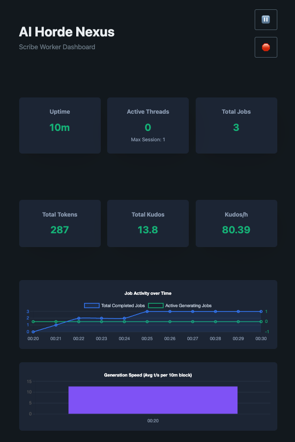

# AI Horde Nexus (Horde Scribe Worker)

A lightweight, highly concurrent, and multi-backend worker for text generation (Scribe) on the [AI Horde](https://aihorde.net/) network.

Designed as a clean, fast alternative to the monolithic official worker, this project provides the essential "glue" between the AI Horde and your local LLM inference engine.

## Key Features

* **Multi-Backend Auto-Detection**: Works out of the box with **KoboldCpp**, **llama.cpp server**, **Aphrodite Engine**, and **TabbyAPI**. The worker automatically probes your backend URL to detect the API format.
* **True Concurrency**: Spin up `N` asynchronous worker threads that independently pop, generate, and submit jobs to fully saturate backends capable of batching (like Aphrodite) or parallel slots (like llama.cpp).
* **Auto-Discovery**: Support for `models_to_serve: ["*"]`. The worker automatically queries your backend to announce the exact loaded model name to the Horde.
* **Resilience & Safety**: Circuit-breaker style health monitoring pauses work if your backend goes offline. Graceful shutdown ensures no in-progress jobs (and kudos) are lost when you press `Ctrl+C`.
* **Lightweight**: Built entirely on `aiohttp` and `pyyaml`. No heavy SDKs, PyTorch, or monolithic ecosystems required. Use `uv` for instant dependency resolution.
* **Docker First**: Ready to deploy across a multi-machine setup with a configurable `docker-compose.yaml`.
* **Real-time WebUI**: A built-in monitoring dashboard served at `http://localhost:8082` with live job tracking, charts, and worker controls.

## WebUI Dashboard

The WebUI provides a real-time view of your worker's activity, directly accessible in any browser at `http://localhost:8082` (or your configured `webui_port`).



## Getting Started

### Prerequisites

Ensure you have a backend (e.g., [KoboldCpp](https://github.com/LostRuins/koboldcpp) or [llama.cpp server](https://github.com/ggml-org/llama.cpp)) already running.
It's highly recommended to use [uv](https://github.com/astral-sh/uv) to manage Python dependencies.

### Installation

1. Clone the repository:
   ```bash
   git clone https://github.com/gustrd/ai-horde-nexus.git
   cd ai-horde-nexus
   ```

2. Scaffolding & Dependencies (using `uv`):
   ```bash
   uv sync --frozen
   ```

3. Setup Configuration:
   ```bash
   cp configs/config.example.yaml configs/config.yaml
   ```
   Edit `configs/config.yaml` to include your AI Horde `api_key` and adjust `max_threads` to match the parallel slots your backend supports.

4. Run the Worker:
   ```bash
   uv run python -m src.main
   ```

The WebUI will be available at [http://localhost:8082](http://localhost:8082) by default.

## Docker Deployment

The worker is designed to be easily deployed across multiple machines using Docker Compose.

1. Review and adjust `docker-compose.yaml` (or pass environmental variables natively):
   ```yaml
   environment:
     - HORDE_API_KEY=your_api_key_here
     - HORDE_WORKER_NAME=Docker-Scribe-Worker
     - HORDE_MAX_THREADS=4
     - HORDE_BACKEND_URL=http://host.docker.internal:5001
   ```

2. Start the container:
   ```bash
   docker compose up -d
   ```

## Configuration Properties

The worker is highly configurable via `configs/config.yaml` or through equivalent Environment Variables (`HORDE_*` prefixed).

| YAML Key | Environment Variable | Default | Description |
|---|---|---|---|
| `horde.api_key` | `HORDE_API_KEY` | `0000...` | API key from aihorde.net (earns Kudos). |
| `worker.name` | `HORDE_WORKER_NAME` | `ScribeWorker` | Distinct name for this worker instance. |
| `worker.max_threads` | `HORDE_MAX_THREADS` | `1` | Number of simultaneous jobs. Align with backend's parallel slots. |
| `worker.max_context_length` | `HORDE_MAX_CONTEXT_LENGTH` | `8192` | Absolute max context limit your worker advertises. |
| `worker.max_length` | `HORDE_MAX_LENGTH` | `512` | Max tokens to generate per request. |
| `worker.models_to_serve` | `HORDE_MODELS_TO_SERVE` | `*` | Comma-separated list of models. `*` enables auto-discovery. |
| `worker.webui_enabled` | `HORDE_WEBUI_ENABLED` | `true` | Enable or disable the WebUI dashboard. |
| `worker.webui_port` | `HORDE_WEBUI_PORT` | `8082` | Port the WebUI listens on. |
| `backend.url` | `HORDE_BACKEND_URL` | `http://localhost:5001` | Your local backend URL. |
| `backend.api_key` | `HORDE_BACKEND_API_KEY` | | Optional Auth Bearer or x-api-key for protected backends. |
| `backend.model_name_override` | `HORDE_BACKEND_MODEL_OVERRIDE` | | Force a specific model name to advertise to the Horde, overriding auto-detection. |
| `backend.timeout` | `HORDE_BACKEND_TIMEOUT` | `300` | Seconds to wait for a generation before timing out. |

## Testing & Development

This project includes a comprehensive test suite using `pytest`. Run it with:

```bash
uv run pytest
```

## Roadmap & Status

- **Phase 1: ✅ DONE.** Complete scaffolding, backend auto-detection, KoboldCpp and llama.cpp integration, threaded polling/submission loop, resilience monitoring, and full unit test coverage.
- **Phase 2: ✅ DONE.** Real-time WebUI dashboard with session-long charts, expandable job history, and worker controls (pause, resume, soft shutdown).
- **Status:** Successfully verified against **KoboldCpp** and **llama.cpp** with up to **3 concurrent threads**.
- **Next Phases:** Suggestions are welcome!
